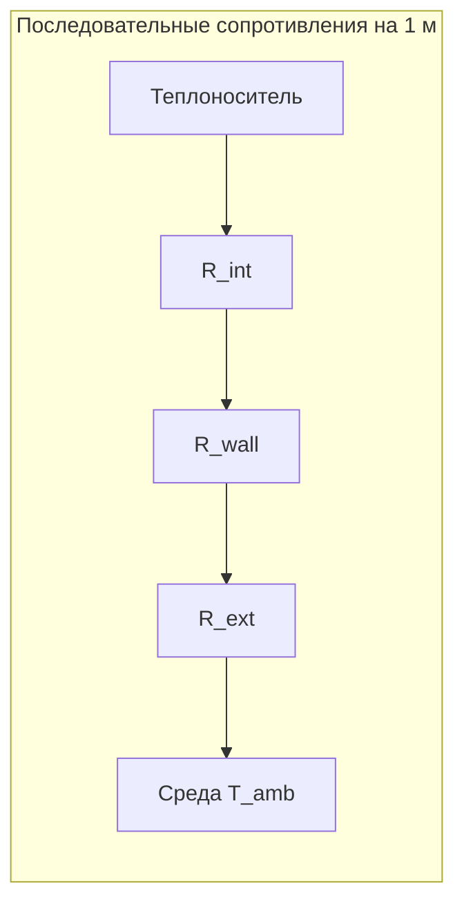
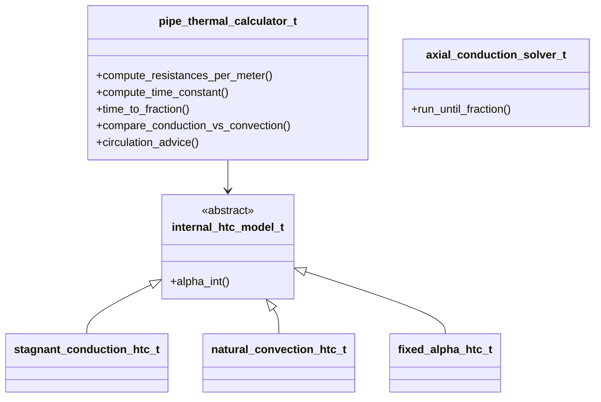

# TZ46 — план: прогрев трубопровода с неподвижным теплоносителем

Источники: [tz.md](documents/TZ46/tz.md), [task.md](documents/TZ46/task.md). Формулы и алгоритм — **только из task.md**; численные свойства материалов — из справочников с явной ссылкой в [analitic.md](documents/TZ46/analitic.md). Параметры примера: вода; T_{initial}=20°C, T_{supply}=80°C; L=1000м; d_{in}=0{,}5м, d_{out}=0{,}6м (стенка \delta=0{,}05м); нержавеющая сталь; T_{amb}=20°C (воздух); \eta=0{,}95.

---

## 1. Что требует ТЗ (кратко)


| Требование ТЗ                                               | Реализация                                                        |
| ----------------------------------------------------------- | ----------------------------------------------------------------- |
| Тепловые сопротивления R_{int}, R_{wall}, R_{ext}, R_\Sigma | `pipe_thermal_calculator_t`                                       |
| Теплоёмкость C_{th}, постоянная времени \tau                | тот же класс                                                      |
| Время до доли \eta: t_\eta = -\tau\ln(1-\eta)               | метод `time_to_fraction`                                          |
| Без конвекции / с естественной конвекцией                   | полиморфный `internal_htc_model_t`                                |
| Выводы о циркуляционном прогреве                            | `circulation_advice` по критериям из task (этап 6)                |
| Универсальность                                             | вход через структуры свойств, не захардкоженный TZ46              |
| Схемы: объектная + блок-схемная                             | два SVG в `documents/TZ46/`                                       |
| Аналитика                                                   | [analitic.md](documents/TZ46/analitic.md)                         |
| ООП в стиле проекта                                         | namespace `thermal_struct`, как `hydraulics_struct` / `numerical` |


**Ограничение модели (из task):** RC с сосредоточенной ёмкостью даёт \tau **на 1 м** и не описывает распространение фронта по длине L=1км. Для длинной трубы — опциональный **FTCS** ([task.md](documents/TZ46/task.md), §8); в отчёте сравнить оба подхода.

---

## 2. Физическая модель (из task.md, без добавлений)




**Сопротивления (на 1 м длины):**

- R_{int} = 1/(\alpha_{int}\pid_{in})
- R_{wall} = \ln(d_{out}/d_{in})/(2\pi\lambda_{wall})
- R_{ext} = 1/(\alpha_{ext}\pid_{out})
- R_\Sigma = R_{int} + R_{wall} + R_{ext}

**Ёмкость и время:**

- C_{th} = \rho_f c_{p,f}\pi d_{in}^2/4 + \rho_w c_{p,w}\pi(d_{out}^2-d_{in}^2)/4 [Дж/(К·м)]
- \tau = R_\Sigma \cdot C_{th} [с]
- T(t) = T_{amb} + (T_{supply}-T_{amb})(1-e^{-t/\tau})
- t_\eta = -\tau\ln(1-\eta)

**Проверка Био:** Bi = \alpha_{ext}\delta_{wall}/\lambda_{wall}; при Bi<0{,}1 — допустима сосредоточенная модель.

**Без конвекции:** \alpha_{int} \approx \lambda_f/d_{in} (task, этап 7).

**С конвекцией:** Nu = C(GrPr)^n, Gr = g\beta\Delta Td_{in}^3/\nu^2, \alpha_{int} = Nu\lambda_f/d_{in}; **C и n — параметры пользователя** (не подбирать «из головы» в коде).

**Коррекция режимов:** \tau_{conv} \approx \tau_{cond}\cdot R_{\Sigma,conv}/R_{\Sigma,cond}.

**FTCS (дополнительно):** T_i^{n+1} = T_i^n + Fo(T_{i-1}^n-2T_i^n+T_{i+1}^n) - \beta(T_i^n-T_{окр}); устойчивость: Fo\le 0{,}5, \beta<1; U = 1/R_\Sigma на 1 м.

---

## 3. Схемы в `documents/TZ46/`

Два **отдельных** файла (как в [tz.md](documents/TZ46/tz.md), строка 26):


| Файл                | Тип                           | Содержание                                                                                                                                                                                                                                          |
| ------------------- | ----------------------------- | --------------------------------------------------------------------------------------------------------------------------------------------------------------------------------------------------------------------------------------------------- |
| `scheme_object.svg` | Объектный (инженерный чертёж) | Продольный разрез: труба L, вход T_{supply}, Q=0, градиент T_{initial}\to теплее у входа; радиальные стрелки q через стенку; среда «воздух» T_{amb}. Врезка поперечного сечения: d_{in}, d_{out}, \delta, подписи слоёв R_{int}, R_{wall}, R_{ext}. |
| `scheme_block.svg`  | Блок-схема                    | Поток расчёта: входные данные → выбор `internal_htc_model_t` → R_\Sigma, C_{th}, \tau → t_\eta → сравнение cond/conv → совет по циркуляции; опциональная ветка FTCS. Маленькая врезка RC: T_{supply} — R_\Sigma — «ёмкость» C_{th} — T_{amb}.       |


Стиль: простые контуры SVG (как учебник), без Mermaid в итоговых рисунках. При необходимости экспорт `scheme.png` из SVG.

**Обновить** [plan.md](documents/TZ46/plan.md): заменить текущий черновик этим разделом + ссылки на SVG.

---

## 4. Архитектура кода

Повторить паттерн TZ36: библиотека `Tasks` + `test_tz46_thermal.cpp`, suite GTest `Tz46`*.

### 4.1. Файлы


| Файл                                                                                   | Назначение                             |
| -------------------------------------------------------------------------------------- | -------------------------------------- |
| [src/pipe_thermal.h](src/pipe_thermal.h), [src/pipe_thermal.cpp](src/pipe_thermal.cpp) | Модуль TZ46                            |
| [test/test_tz46_thermal.cpp](test/test_tz46_thermal.cpp)                               | Тесты                                  |
| [CMakeLists.txt](CMakeLists.txt)                                                       | Добавить `.cpp/.h` в `Tasks` и `Tests` |


### 4.2. Namespace `thermal_struct`

**Структуры данных** (по аналогии с `pipe_properties_t`, `oil_properties_t`):

- `fluid_properties_t` — \rho, c_p, \lambda, \nu, \beta (теплоноситель); `create_water_at_celsius(double T_C)` с табличными значениями и комментарием температуры опорной точки
- `wall_material_properties_t` — \rho, c_p, \lambda; `create_stainless_steel()` со справочными константами
- `pipe_thermal_geometry_t` — d_{in}, d_{out} или d_{in}, \delta, длина L; `check_parameters()`
- `thermal_boundary_t` — T_{supply}, T_{initial}, T_{amb}, \alpha_{ext}
- `thermal_resistance_result_t`, `thermal_capacity_result_t`, `thermal_transient_result_t` — результаты расчёта

**Полиморфизм внутреннего теплоотдачи** (как `root_equation_t` / `hydro_model_t`):

```cpp
class internal_htc_model_t {
public:
    virtual ~internal_htc_model_t() = default;
    virtual double alpha_int(double d_in, const fluid_properties_t& fluid,
                             double delta_T_char) const = 0;
};

class stagnant_conduction_htc_t : public internal_htc_model_t;  // λ_f / d_in
class natural_convection_htc_t : public internal_htc_model_t;   // Nu(C,n, Gr, Pr)
class fixed_alpha_htc_t : public internal_htc_model_t;          // заданный α
```

**Калькулятор:**

- `pipe_thermal_calculator_t` — хранит геометрию, границы, `std::unique_ptr<internal_htc_model_t>`:
  - `compute_resistances_per_meter()` → R_{int}, R_{wall}, R_{ext}, R_\Sigma, Bi
  - `compute_capacity_per_meter()` → C_{th}
  - `compute_time_constant()` → \tau
  - `time_to_fraction(double eta)` → t_\eta
  - `compare_conduction_vs_convection(...)` — два режима, отношение \tau
  - `circulation_advice(double length_m, double delta_T)` — текст/enum по критериям task §6 (длина, \Delta T, время)

**Численная ось (опционально v1, но заложить в план):**

- `axial_conduction_solver_t` — FTCS по формулам task; вход: L, N_x, \Delta t, U, T_{окр}; выход: время до \eta по **средней** или **концевой** температуре (зафиксировать в API и analitic)

Свободные функции-SI при необходимости: `diameter_si`, `length_si` — по образцу [pipe_oil.h](src/pipe_oil.h).

### 4.3. Диаграмма классов (логика, не файл-схема)




---

## 5. [analitic.md](documents/TZ46/analitic.md) — структура документа

По образцу [documents/TZ36/Аналитическое_решение.md](documents/TZ36/Аналитическое_решение.md):

1. **Постановка** — таблица исходных данных (геометрия, температуры, T_{amb}=20°C, \eta=0{,}95).
2. **Допущения** — воздух снаружи; \alpha_{ext} — **явно в таблице** (справочное значение с источником, не из ТЗ); свойства воды при выбранной T_{опор}; сталь AISI/12Х18Н10Т — \lambda_{wall}, \rho_w, c_{p,w} со ссылкой; для конвекции — таблица C, n как параметры корреляции; \Delta T_{char} для Gr (например (T_{supply}-T_{initial})/2, с обоснованием).
3. **Шаг 1–2** — численный расчёт R_{int}, R_{wall}, R_{ext}, R_\Sigma для режима **без** перемешивания (\alpha_{int}=\lambda_f/d_{in}).
4. **Шаг 3–4** — C_{th}, \tau, t_{0{,}95}; проверка Bi.
5. **Шаг 5** — пересчёт с `natural_convection_htc_t` (те же формулы, другой \alpha_{int}); \tau_{conv}/\tau_{cond}.
6. **Длина 1 км** — пояснение: \tau на 1 м **не масштабируется** с L в lumped RC; оценка времени «прогрева всей длины» — порядок через FTCS или качественно (фронт по оси); не выдавать один t_{95} за полный километр только из RC без оговорки.
7. **Циркуляционный прогрев** — вывод по критериям task (длина 1000 м, \Delta T=60K → целесообразна).
8. **Сверка с кодом** — ссылка на тесты `Tz46AnalyticExample`.

**Не выдумывать:** если величина не следует из task — помечать «допущение примера» (в т.ч. \alpha_{ext}, C, n).

---

## 6. Тесты GTest

Файл [test/test_tz46_thermal.cpp](test/test_tz46_thermal.cpp):


| Suite                 | Проверка                                                        |
| --------------------- | --------------------------------------------------------------- |
| `Tz46Resistances`     | R_{wall} при известных d_{in}, d_{out}, \lambda; сумма R_\Sigma |
| `Tz46TimeConstant`    | \tau = R_\Sigma C_{th}; t_{0{,}95} \approx 3\tau                |
| `Tz46ConvectionRatio` | \tau_{conv} < \tau_{cond} при росте \alpha_{int}                |
| `Tz46AnalyticExample` | числа из analitic.md (допуск 1–2%)                              |
| `Tz46FtcsSmoke`       | устойчивый шаг, монотонный рост T у входа (если FTCS в v1)      |


Запуск: `./Tests --gtest_filter=Tz46`* (как TZ36).

---

## 7. Этапы реализации

1. **Документация:** перезаписать [plan.md](documents/TZ46/plan.md) этим планом; нарисовать `scheme_object.svg`, `scheme_block.svg`.
2. **analitic.md:** полный расчёт с таблицами и числами для примера TZ.
3. **Ядро RC:** `pipe_thermal.h/.cpp`, три реализации `internal_htc_model_t`, `pipe_thermal_calculator_t`.
4. **CMake + тесты** без FTCS.
5. **FTCS** (если остаётся время v1): `axial_conduction_solver_t` + тест дымовой.
6. **Совет по циркуляции** и сравнение режимов в тесте/выводе.

---

## 8. Риски и явные границы

- **RC ≠ прогрев 1 км по времени** — в отчёте обязательно разделить «постоянная времени сечения/1 м» и «прогрев по длине».
- **T_{amb}=T_{initial}=20°C** — потери в начальный момент малы; \Delta T_{char} для Gr брать из нагрева, не из нуля.
- **C, n** — только из ввода пользователя; в analitic — одна строка таблицы с выбранными значениями и ссылкой на корреляцию.
- **Не в scope v1:** неявные схемы, TDMA, расчёт насоса, зависимость свойств от T(t).

