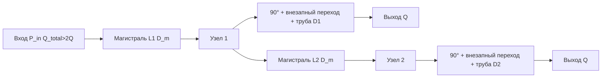

# TZ36 — схема топологии и баланс в узлах

## Схематический рисунок

## Обозначения

- **P_in** — заданное давление на входе в первую магистраль; объёмный расход в ней **2Q** (на каждое боковое ответвление уходит по **Q**).
- **Узел 1** — тройник после участка магистрали длины **L1**; давление **P1** после потерь на участке «вход → узел 1».
- **Ветвь 1** — поворот 90°, при **D1 ≠ D_m** — внезапное сужение или расширение (автоматически по знаку **D1 − D_m**); при **D1 ≈ D_m** второе МС не ставится (нет сужения/расширения), далее труба; на выходе расход **Q**, давление **P_out1**.
- **Узел 2** — после магистрального участка длины **L2** с расходом **Q**; давление **P2**.
- **Ветвь 2** — аналогичная последовательность с неизвестным **D2**; на выходе снова **Q**.

## Условие равенства режимов потребителей

Принимаем, что оба «потребителя» имеют одинаковое давление на выходе (**P_out1 = P_out2**). Тогда для подобранного **D2** при расчёте ветви 2 от **P2** с расходом **Q** выходное давление должно совпасть с **P_out1**, то есть невязка **F(D2) = P_out2(D2) − P_out1 → 0**.

Связь узлов: **P1** считается по магистрали с **2Q**; **P_out1** — по ветви 1 от **P1** и **Q**; **P2** — по магистрали от **P1** с **Q**; перепад на ветви 2 задаётся согласованием с **P_out1**.

Подбор **D2** дихотомией допускается только на интервале, целиком лежащем по одну сторону от **D_m** (иначе при пересечении **D_m** меняется вид перехода и невязка теряет гладкость); см. `assert_bisection_interval_one_side_of_main` в [`test/tz36_chain_helpers.h`](../../test/tz36_chain_helpers.h).

Проверка: тесты `Tz36FullScheme` в [`test/test_tz36_branching.cpp`](../../test/test_tz36_branching.cpp) — полная схема и аналитические примеры 9.1/9.2 ([`Аналитическое_решение.md`](Аналитическое_решение.md)). Вспомогательная логика — в [`src/tz36_chain_helpers.h`](../../src/tz36_chain_helpers.h).

## Сборка и запуск тестов

Собирать проект нужно через **CMake preset** из корня [`CMakePresets.json`](../../CMakePresets.json) (vcpkg, GTest, fixed_solvers). Пример для Linux: `cmake --preset linux-gcc-debug`, затем `cmake --build --preset linux-gcc-debug` и `ctest --preset linux-gcc-debug` или запуск `Tests` из каталога `out/linux-gcc-debug/` с фильтром `Tz36*`.
