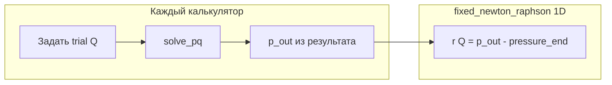

# План: PP-задача (`solve_pp`) через Ньютон fixed_solvers

## Кратко (обзор)

На этой итерации — только реализация методов `solve_pp` (труба, локальное сопротивление, насос, станция) через Ньютон из fixed_solvers и невязку по давлению; полиморфные абстракции и «общая архитектура цепочки» не затрагиваются. Плюс CMake на цель `Tasks`, исправление цикла `solve_pq` у трубы, обновление тестов. В код и параметры решателя закладывается **подготовленность к ожидаемым сбоям** — это **часть того же плана реализации**, что и шаги по Ньютону и `solve_pq` (см. раздел «План реализации» ниже, шаги 6–9).

## Чек-лист задач

- [ ] Исправить цикл и индексацию в `pipe_calculator_t::solve_pq` ([`src/pipe_oil.cpp`](../../src/pipe_oil.cpp)), убедиться по тестам трубы
- [ ] Подключить fixed_solvers к `Tasks`; префикс `$HOME/install` для `find_package` (`CMAKE_PREFIX_PATH` или `list(APPEND)` перед `find_package`)
- [ ] При необходимости — минимальный общий хелпер (`fixed_system_t<1>` + Ньютон) без полиморфных интерфейсов; допускается небольшое дублирование между классами
- [ ] Реализовать `solve_pp` в `pipe_oil`, `local_resistance`, `pump`, `pump_station` по **плану реализации** ниже (пункты 1–9: численное ядро, невязка, специфика классов, устойчивость)
- [ ] Переписать тесты `solve_pp` (pipe, local, pump, CSV-сценарий) на проверку расхода и давления; негативный кейс — см. шаг **9** плана реализации и раздел «Тесты»

## Исходные требования

- ТЗ: [2_pp_pipe_tz.md](2_pp_pipe_tz.md) — известны `pressure_start` и `pressure_end`, ищется расход `Q`; невязка **r(Q) = p_out,calc(Q) − p_out,target**; корень — **Ньютон из fixed_solvers**; внутри итерации — существующий **`solve_pq`** при подставляемом `Q`.
- **Вне скоупа данной итерации:** требования ТЗ про «выделить сущность модели трубы под полиморфную архитектуру» и общий полиморфный интерфейс — **не делать**; вернуться позже при отдельной задаче.
- Из официальной формулировки «2_pp_pipe» на этой итерации оставляем только: корректный расчёт PP для одиночной трубы и остальных элементов по той же идее невязки + **тест на корректность найденного расхода** (и давления на выходе).

## Текущее состояние кода

- Заглушки `throw std::runtime_error("Код пока не реализован")`: [`src/pipe_oil.cpp`](../../src/pipe_oil.cpp) (`pipe_calculator_t::solve_pp`), [`src/local_resistance.cpp`](../../src/local_resistance.cpp), [`src/pump.cpp`](../../src/pump.cpp) (насос и станция).
- [`CMakeLists.txt`](../../CMakeLists.txt): `fixed_solvers` подключается к **Tests**, цель **Tasks** с ним **не** линкуется — для вызова `fixed_newton_raphson<1>::solve` из реализации `solve_pp` нужно добавить `target_link_libraries(Tasks ... fixed_solvers::fixed_solvers)` (предпочтительно держать `#include` из fixed_solvers только в `.cpp`, чтобы не раздувать публичный API библиотеки `Tasks`).
- **Где лежит собранный fixed_solvers:** в домашней директории, каталог **`install`** (т.е. `$HOME/install`) — при конфигурации CMake задавать `CMAKE_PREFIX_PATH` с этим путём **или** в начале `CMakeLists.txt` проекта Calc один раз добавить в префиксы поиска, например `list(APPEND CMAKE_PREFIX_PATH "$ENV{HOME}/install")` перед `find_package(fixed_solvers ...)`, чтобы не тянуть `FetchContent`, если локальная установка уже есть.
- API fixed_solvers: скалярная система — `fixed_system_t<1>` с `double residuals(double Q)`, запуск — `fixed_newton_raphson<1>::solve` / `solve_dense` (заголовки в установленном пакете; исходники также в соседнем репозитории `fixed_solvers`, если нужно смотреть API).
- **Баг, блокирующий корректный `solve_pq` у трубы:** в `pipe_calculator_t::solve_pq` цикл `for (size_t i; i < ...)` — переменная **`i` не инициализирована** ([`src/pipe_oil.cpp`](../../src/pipe_oil.cpp), ~302–316). Без исправления PP по трубе ненадёжен. План: заменить на явный проход по сегментам с согласованной индексацией для `get_diff_pressure` / профиля — сверить с логикой `solve_qp` и тестами.

## План реализации (без полиморфности)

Ниже единый порядок работ: шаги **1–5** — постановка PP и численное ядро, шаги **6–9** — обязательная **устойчивость к ошибкам и рискам** в той же реализации (не отдельная фаза «потом»).

1. **Численное ядро:** либо один небольшой `.cpp` с free-function `solve_pp_scalar_newton(...)` и локальным классом-наследником `fixed_system_t<1>`, либо похожий код в каждом `solve_pp` — приоритет **простота и читаемость**, не абстракции.
2. **Логика в хелпере или повторяемо:** начальное `Q0`, целевое `pressure_end`, вычисление невязки через лямбду (выставить `volume_flow`, при необходимости сбросить буферы результата, `solve_pq`, вернуть `p_out_calc - pressure_end`); `fixed_solver_parameters_t<1,...>`; `fixed_newton_raphson<1>::solve`; при неуспехе — `std::runtime_error` с **текстом, по которому понятна причина** (несходимость Ньютона, NaN, отрицательное давление на пробном `Q` и т.д.).
3. **Специфика по классам** (прямо в `solve_pp` каждого типа):
   - **Труба:** `Q` = `volume_flow` (`get_volume_flow_rate` уже учитывает `volume_flow` vs `mass_flow`); `p_out,calc` — последнее давление в `pipe_task_result.pressure_profile` после `solve_pq`; граничные давления — поля `pressure_start` / `pressure_end`.
   - **Локальное сопротивление:** после `solve_pq` — `local_resistanc_task_result.pressure_out`.
   - **Насос / станция:** после `solve_pq` — `pressure_out` в соответствующей структуре результата ([`src/pump.cpp`](../../src/pump.cpp)).
4. **После успешного Ньютона:** записать `Q` в `pipe_task_result.volume_flow` / поля насосов; при необходимости финальный вызов `solve_pq` для согласованных профилей.
5. **Начальное `Q0`:** для трубы — по возможности `get_velocity_by_solve_pp() * get_pipe_area()` из закомментированного кода; для остальных — простая эвристика (например 0 или знак по перепаду давления), без проектирования под будущий полиморфный интерфейс.
6. **Перед Ньютоном (валидация):** проверить заданность полей (`pressure_start`, `pressure_end`, свойства жидкости/геометрии, частота насоса и т.д. по типу элемента); при нарушении — сразу `std::runtime_error`, что именно не задано. Для трубы: исправленный `solve_pq` и согласованный профиль; при одной точке профиля или неконсистентных данных — явный отказ, без вызова решателя.
7. **Внутри пробной невязки:** перед каждым пробным `Q` сбрасывать накопленные профили/поля результата; проверять `std::isfinite` для невязки и `p_out,calc`. Сообщения при исключении из `solve_pq` сохранять или дополнять контекстом (`solve_pp`, значение `Q`), чтобы отличать гидравлику от сбоя решателя.
8. **Параметры `fixed_newton_raphson` / `fixed_solver_parameters_t`:** лимит `iteration_count`, критерий по аргументу и/или по норме невязки (`residuals_norm`, при необходимости ранний выход); по возможности ограничить диапазон `Q` через `constraints`. Если итог решателя не «успех» — не считать задачу решённой: предпочтительно `runtime_error` с итогом; не оставлять частично заполненный результат без явной политики.
9. **Завершение и контроль:** финальный `solve_pq` при необходимости; проверка `|p_out - pressure_end|` с допуском; при вылете — ошибка. В тестах — по возможности негативный сценарий (плохие/пустые входы): стабильное исключение, без UB.

## Поэтапная логика `solve_pp` (как устроено в коде)

Смысл **PP-задачи** везде один: заданы давления на входе и на выходе элемента (`pressure_start`, `pressure_end`), нужно подобрать **объёмный расход** `volume_flow` (обозначим \(Q\)), при котором «прямой» расчёт `solve_pq` даёт на выходе то же давление, что задано в `pressure_end`.

### 1. Математическая постановка внутри итерации

Ищется корень скалярного уравнения

\[
r(Q) = p_{\text{out,calc}}(Q) - p_{\text{end}} = 0,
\]

где \(p_{\text{out,calc}}(Q)\) — давление на выходе после вызова `solve_pq()` при подставленном \(Q\).

Численно это делает общий хелпер [`src/solve_pp_newton.cpp`](../../src/solve_pp_newton.cpp): класс-наследник `fixed_system_t<1>` с методом `residuals(q)` и вызов `fixed_newton_raphson<1>::solve` из **fixed_solvers** (`solve_pp_volume_flow_newton`).

### 2. Общая последовательность шагов (труба, местное сопротивление, насос, насосная станция)

**Шаг A — проверки входа**

- `validate_pp_pressures_finite`: `pressure_start` и `pressure_end` должны быть конечными.
- Далее — проверки, специфичные для класса: труба (профиль, не меньше двух точек, свойства трубы), местное сопротивление (положительный коэффициент \(\xi\)), насосная станция (непустой состав насосов) и т.п.

**Шаг B — допуск по давлению**

- Вычисляется `abs_tolerance`: не меньше 200 Па и доля от масштаба давлений (`max(200, 1e-7 * max(|pressure_start|, |pressure_end|))` в реализациях элементов).

**Шаг C — невязка как функция от \(Q\)**

- Лямбда `residual_at_q`: записать `volume_flow = Q`, вызвать `solve_pq()`, вернуть **расчётное выходное давление минус `pressure_end`**.
  - **Труба:** последний узел `pipe_task_result.pressure_profile` ([`pipe_calculator_t::solve_pp`](../../src/pipe_oil.cpp)).
  - **Местное сопротивление:** `local_resistanc_task_result.pressure_out`.
  - **Насос / станция:** `pressure_out` в соответствующей структуре результата ([`src/pump.cpp`](../../src/pump.cpp)).

**Шаг D — начальные приближения и Ньютон**

- Перебираются несколько стартовых значений \(Q\) (для трубы — сетка масштабов относительно площади поперечного сечения с `std::clamp` и границами `q_min` / `q_max`; для местного сопротивления — дополнительно оценка из перепада давления и знак; для насоса и станции — оценка из напорной характеристики и сетка малых \(\pm Q\)).
- Для каждого старта вызывается `solve_pp_volume_flow_newton(...)`; при успехе цикл прерывается, при неуспехе запоминается последнее исключение и пробуется следующий старт.

**Шаг E — внутри `solve_pp_volume_flow_newton`**

- Сборка системы для Ньютона: на каждом пробном `q` вызывается переданная невязка; проверяется `std::isfinite` для `q` и для значения невязки; ошибки из `solve_pq` пробрасываются с контекстом (`solve_pp`, значение `Q`).
- Параметры решателя: лимит итераций, нормы по аргументу и невязке, ранний выход по норме невязки; для **трубы** — ограничение \(Q\) снизу и сверху через `constraints` в `make_pp_newton_parameters`.
- Если код результата Ньютона не «сошёлся», но невязка по модулю не превышает допуск — расход всё равно может быть принят (см. ветку в [`solve_pp_volume_flow_newton`](../../src/solve_pp_newton.cpp)); иначе — `std::runtime_error`.

**Шаг F — фиксация результата**

- В поля калькулятора и в структуру результата записывается найденный `volume_flow`.
- Повторный вызов **`solve_pq()`** — чтобы профили и поля результата соответствовали финальному \(Q\).
- **`assert_pp_outlet_pressure_closed`**: итоговое давление на выходе должно отличаться от `pressure_end` не больше чем на `abs_tolerance`; иначе исключение.

### 3. Цепочка (`chain_task_calculator_t::solve_pp`)

Отдельного скалярного Ньютона на уровне цепочки нет: по списку элементов [`hydraulic_chain.cpp`](../../src/hydraulic_chain.cpp) для каждого звена создаётся соответствующий калькулятор, ему задаются `pressure_start` / `pressure_end` из полей цепочки (`pressure_in` / `pressure_out`), вызывается **`solve_pp` этого элемента**; из результата читается `volume_flow`. То есть PP на уровне цепочки здесь сводится к **делегированию** в расчётчик конкретного типа звена.

### 4. Краткая сводка по классам

| Класс | Откуда берётся \(p_{\text{out,calc}}\) после `solve_pq` | Особенности старта \(Q\) |
|--------|-----------------------------------------------------------|---------------------------|
| `pipe_calculator_t` | последний элемент `pressure_profile` | сетка `scale * area` в `[q_min, q_max]` |
| `local_resistance_calculator_t` | `pressure_out` результата | оценка из \(\sqrt{2 A^2 \Delta p / (\rho \xi)}\), знак, сетка |
| `pump_calculator_t` | `pump_task_result.pressure_out` | `get_volume_flow_from_head_at_current_frequency`, затем сетка \(\pm Q\) |
| `pump_station_calculator_t` | `pump_station_result.pressure_out` | `get_volume_flow_from_head_nominal`, затем сетка \(\pm Q\) |

**Итог одной фразой:** `solve_pp` — это **итеративный подбор объёмного расхода методом Ньютона** так, чтобы при заданных давлениях на концах **`solve_pq` давал целевое давление на выходе**; в конце — контроль по допуску и повторный `solve_pq` для согласованного результата.

## Тесты

- [`test/test_pipe_oil.cpp`](../../test/test_pipe_oil.cpp): заменить `SolvePpIsNotImplementedYet` и сценарий `PipeTaskCsv::WritesSolvePpScenarioProfilesToExeRelativeProfilesDir` — вместо `EXPECT_THROW(solve_pp)` проверять `EXPECT_NO_THROW`, сходимость по давлению на конце (допуск по абсолютной/относительной погрешности), конечный `volume_flow`, при CSV — строить эталонные ряды из **`get_pipe_task_result()`** после успешного `solve_pp`. Негативный кейс — см. шаг **9** плана реализации.
- [`test/test_local_resistance.cpp`](../../test/test_local_resistance.cpp), [`test/test_pump.cpp`](../../test/test_pump.cpp): аналогично — проверка найденного расхода и выходного давления vs целевое.

## Порядок выполнения

1. Исправить цикл в `pipe_calculator_t::solve_pq` и прогнать существующие тесты трубы.
2. Добавить линковку `fixed_solvers` к `Tasks` в CMake; реализовать `solve_pp` **по плану реализации (пункты 1–9)**: численное ядро, невязка, специфика классов, валидация, параметры решателя, контроль результата и сообщения об ошибках.
3. Обновить тесты (включая негативные при наличии простого кейса) и прогнать `ctest` / сборку.

## Риски и смягчение (согласованы с планом реализации)

Пересекаются с шагами **5–9** плана реализации; здесь — кратко «что может пойти не так» и запасной ход.

- **Плохое `Q0` / немонотонная невязка:** несколько эвристик старта (например смена знака или масштаба `Q0`), при необходимости расширение диапазона в `constraints`, fallback на более мягкие параметры итераций — только если не раздувает код; минимум — явная ошибка «не сошлось, попробуйте другой старт».
- **Отрицательное давление на пробном `Q`:** `solve_pq` уже бросает; см. обёртку и контекст в сообщении; ограничение `Q` снижает частоту.
- **Несходимость Ньютона:** проверка `result_code`, лимит итераций, опционально дублирующий контроль невязки в конце; не маскировать неуспех под успех.
- **CMake / отсутствие пакета:** если `$HOME/install` не в префиксах — понятное сообщение при `find_package` (или документированный обязательный `-DCMAKE_PREFIX_PATH`), чтобы не гадать, почему тянется FetchContent или падает линковка.
