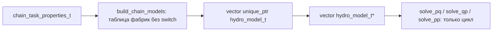

# План: PQ/QP/PP-цепочка на полиморфизме (задача 3)

ТЗ: [3_pq_chain_tz.md](3_pq_chain_tz.md).

**Принцип (из ТЗ):** не создавать отдельные модули; переделать [hydraulic_chain.h](../../src/hydraulic_chain.h) / [hydraulic_chain.cpp](../../src/hydraulic_chain.cpp) и существующие калькуляторы. Образец полиморфизма — [logger_base.h](../../src/logger_base.h).

**Объём:** полиморфный проход для **`solve_pq`**, **`solve_qp`** и **`solve_pp`**. В [hydraulic_chain.cpp](../../src/hydraulic_chain.cpp) **не должно остаться `switch`** (ни в расчётных методах, ни в фабрике сборки цепочки).

**Вне текущей реализации:** новые и доработанные тесты (см. §5) — **не писать на этом этапе**; правки `test_*.cpp` (include, смешанная цепочка, `nullptr`) — отдельно, позже.

---

## Текущее состояние

| Что есть | Проблема |
|----------|----------|
| `chain_task_properties_t` + `type_of_obj_t` + параллельные векторы свойств | Нет `hydro_model_t`, нет вектора указателей на базовый тип |
| `chain_task_calculator_t::solve_pq/qp/pp` | `switch` по типу; в `solve_pq` нет `break` (fall-through) |
| Рабочие `solve_*` у четырёх калькуляторов | Не наследуют общий интерфейс |
| [test_hydraulic_chain.cpp](../../test/test_hydraulic_chain.cpp) | Только валидация входов |

Дефекты черновика (исправить при рефакторинге):

- между звеньями PQ не прокидывается `pressure_in = pressure_out`;
- результаты читаются из `chain_task_result`, а пишутся в локальные `calc_*`.

---

## Целевая архитектура



**Разделение ответственности:**

- **Сборка цепочки:** один раз в конструкторе `chain_task_calculator_t` — диспетчеризация по `type_of_obj_t` через **таблицу функций** (см. ниже), не через `switch`.
- **Расчёт (`solve_pq`, `solve_qp`, `solve_pp`):** только цикл по `chain_models_`, полиморфные вызовы `hydro_model_t`.

---

## 1. Интерфейс `hydro_model_t` — [hydraulic_chain.h](../../src/hydraulic_chain.h) / [hydraulic_chain.cpp](../../src/hydraulic_chain.cpp)

**Базовый тип объявляется в `hydraulic_chain.h`**, не в `pipe_oil.h`. Все четыре калькулятора наследуются от него:

- `pipe_calculator_t`
- `local_resistance_calculator_t`
- `pump_calculator_t`
- `pump_station_calculator_t`

**Что в каком файле:**

| Файл | Содержимое |
|------|------------|
| [hydraulic_chain.h](../../src/hydraulic_chain.h) | объявление `hydro_model_t`; затем `#include` заголовков элементов; `chain_task_properties_t`, `chain_task_result_t`, `chain_task_calculator_t` |
| [hydraulic_chain.cpp](../../src/hydraulic_chain.cpp) | `build_chain_models`, фабрики `create_*_model`, циклы `solve_pq` / `solve_qp` / `solve_pp`, `ensure_not_null` |
| [pipe_oil.cpp](../../src/pipe_oil.cpp), [local_resistance.cpp](../../src/local_resistance.cpp), [pump.cpp](../../src/pump.cpp) | `override` у `pipe_calculator_t` и остальных: `solve_*`, `apply_*`, `outlet_*` / `inlet_*` / `volume_flow_after_pp`, `commit_*` (математика PQ/QP/PP без изменений) |

Т.е. **интерфейс и «движок» цепочки** — в модуле цепочки; **физика элемента** — в своих `.cpp`, как сейчас.

### Порядок в [hydraulic_chain.h](../../src/hydraulic_chain.h) (без циклического include)

Сейчас в начале файла сразу `#include "pipe_oil.h"`. Нужно **переставить**:

```cpp
#pragma once
#include <array>
#include <limits>
#include <memory>
#include <vector>
// ...

namespace hydraulics_struct {

struct chain_task_result_t;  // forward для сигнатур commit_*

/// @brief Базовый полиморфный элемент гидравлической цепочки (lab10, задача 3).
struct hydro_model_t {
    virtual ~hydro_model_t() = default;
    virtual void solve_pq() = 0;
    virtual void solve_qp() = 0;
    virtual void solve_pp() = 0;
    virtual void apply_pq_boundary(double pressure_in, double volume_flow) = 0;
    virtual void apply_qp_boundary(double pressure_out, double volume_flow) = 0;
    virtual void apply_pp_boundary(double pressure_in, double pressure_out) = 0;
    virtual double outlet_pressure_after_pq() const = 0;
    virtual double inlet_pressure_after_qp() const = 0;
    virtual double volume_flow_after_pp() const = 0;
    virtual void commit_pq_result(chain_task_result_t&) const = 0;
    virtual void commit_qp_result(chain_task_result_t&) const = 0;
    virtual void commit_pp_result(chain_task_result_t&) const = 0;
};

} // namespace

#include "pipe_oil.h"
#include "local_resistance.h"
#include "pump.h"

namespace hydraulics_struct {

enum class type_of_obj_t { ... };
struct chain_task_properties_t { ... };
struct chain_task_result_t { ... };   // полное определение — здесь, после include элементов
class chain_task_calculator_t { ... };

} // namespace
```

### Подключение `hydraulic_chain.h` в модулях объектов и тестах

**Правило:** [hydraulic_chain.h](../../src/hydraulic_chain.h) — единая точка входа для любого кода, где нужны калькуляторы с `: public hydro_model_t`. Её подключают **во всех файлах объектов** (заголовки и реализации) и **в тестах элементов** вместо узких заголовков.

#### Заголовки элементов

Перед объявлением класса-калькулятора (не в самой первой строке файла — после структур свойств/результатов):

| Файл | Было | Стало |
|------|------|--------|
| [pipe_oil.h](../../src/pipe_oil.h) | только STL | перед `class pipe_calculator_t` — `#include "hydraulic_chain.h"` |
| [local_resistance.h](../../src/local_resistance.h) | `#include "pipe_oil.h"` | `#include "hydraulic_chain.h"` (типы трубы придут через chain → pipe_oil) |
| [pump.h](../../src/pump.h) | `#include "pipe_oil.h"` | `#include "hydraulic_chain.h"` |

**Цикл include** (когда `pipe_oil.h` тянет `hydraulic_chain.h`, а chain снова тянет `pipe_oil.h`): безопасен за счёт `#pragma once` — при повторном входе в `pipe_oil.h` тело пропускается, а `hydro_model_t` к этому моменту уже объявлен в `hydraulic_chain.h`.

#### Реализации (.cpp)

Первый include — `hydraulic_chain.h` (вместо локального `.h`):

| Файл | Было | Стало |
|------|------|--------|
| [pipe_oil.cpp](../../src/pipe_oil.cpp) | `#include "pipe_oil.h"` | `#include "hydraulic_chain.h"` |
| [local_resistance.cpp](../../src/local_resistance.cpp) | `#include "local_resistance.h"` | `#include "hydraulic_chain.h"` |
| [pump.cpp](../../src/pump.cpp) | `#include "pump.h"` | `#include "hydraulic_chain.h"` |
| [hydraulic_chain.cpp](../../src/hydraulic_chain.cpp) | без изменений | `#include "hydraulic_chain.h"` |

#### Тесты (include — позже)

Замена узких заголовков на `hydraulic_chain.h` в `test_pipe_oil`, `test_local_resistance`, `test_pump` **запланирована**, но **не входит в текущую реализацию** (см. §5). На этапе кода достаточно, чтобы проект **собирался** с существующими тестами (при необходимости — минимальная правка include только ради компиляции, без новых `TEST`).

---

## 2. Наследование калькуляторов

В [pipe_oil.h](../../src/pipe_oil.h), [local_resistance.h](../../src/local_resistance.h), [pump.h](../../src/pump.h) — только **наследование и `override` в объявлениях**:

```cpp
class pipe_calculator_t : public hydro_model_t {
    void solve_pq() override;
    void apply_pq_boundary(double pressure_in, double volume_flow) override;
    // ...
};
```

- `solve_pq` / `solve_qp` / `solve_pp` — тела в своих `.cpp`, математика без изменений.

| Метод | Назначение |
|-------|------------|
| `apply_pq_boundary` | `pressure_start`, `volume_flow` |
| `apply_qp_boundary` | `pressure_end`, `volume_flow` |
| `apply_pp_boundary` | `pressure_start`, `pressure_end` |
| `outlet_pressure_after_pq` | труба: `pressure_profile.back()`; остальные: `pressure_out` из результата |
| `inlet_pressure_after_qp` | труба: `pressure_profile.front()`; остальные: `pressure_in` |
| `volume_flow_after_pp` | `volume_flow` из своего `*_task_result` |
| `commit_*_result` | копия последнего расчёта в поле `chain_task_result_t` |

---

## 3. `chain_task_calculator_t`

### Поля ([hydraulic_chain.h](../../src/hydraulic_chain.h))

```cpp
std::vector<std::unique_ptr<hydro_model_t>> owned_models_;
std::vector<hydro_model_t*> chain_models_;
```

Приватно: `void build_chain_models();`

### Фабрика без `switch`

В [hydraulic_chain.cpp](../../src/hydraulic_chain.cpp) — анонимный namespace:

```cpp
struct chain_build_indices_t { size_t pipe, local, pump, station; };

using hydro_factory_fn = std::unique_ptr<hydro_model_t> (*)(
    const chain_task_properties_t&, chain_build_indices_t&);

// create_pipe_model, create_local_model, create_pump_model, create_station_model
```

Таблица по индексу enum (порядок совпадает с `type_of_obj_t`):

```cpp
constexpr std::array<hydro_factory_fn, 4> k_hydro_factories = {
    &create_pipe_model,
    &create_local_resistance_model,
    &create_pump_model,
    &create_pump_station_model,
};

// build_chain_models:
const auto idx = static_cast<std::size_t>(elem);
if (idx >= k_hydro_factories.size()) throw ...;
owned_models_.push_back(k_hydro_factories[idx](props, indices));
chain_models_.push_back(owned_models_.back().get());
```

Валидация входов (`validate_pipe_inputs` и т.д.) вызывается **внутри** соответствующей `create_*_model` — логика типа остаётся рядом с созданием объекта, не в `solve_*`.

Альтернатива с тем же эффектом: `std::unordered_map<type_of_obj_t, hydro_factory_fn>` — главное, **ни одного `switch` в файле**.

### `solve_pq()`

```cpp
double p = pressure_in;
chain_task_result.pressure_in = pressure_in;
chain_task_result.volume_flow = volume_flow;
for (hydro_model_t* elem : chain_models_) {
    ensure_not_null(elem);
    elem->apply_pq_boundary(p, volume_flow);
    elem->solve_pq();
    elem->commit_pq_result(chain_task_result);
    p = elem->outlet_pressure_after_pq();
}
pressure_out = p;
chain_task_result.pressure_out = p;
```

### `solve_qp()`

Обратный проход по `chain_models_` (`std::views::reverse`):

```cpp
double p = pressure_out;
for (hydro_model_t* elem : reversed(chain_models_)) {
    ensure_not_null(elem);
    elem->apply_qp_boundary(p, volume_flow);
    elem->solve_qp();
    elem->commit_qp_result(chain_task_result);
    p = elem->inlet_pressure_after_qp();
}
pressure_in = p;
chain_task_result.pressure_in = pressure_in;
```

### `solve_pp()`

Прямой проход (сохранить семантику черновика: общие `pressure_in` / `pressure_out` на каждое звено, итоговый `volume_flow` — от последнего элемента):

```cpp
for (hydro_model_t* elem : chain_models_) {
    ensure_not_null(elem);
    elem->apply_pp_boundary(pressure_in, pressure_out);
    elem->solve_pp();
    elem->commit_pp_result(chain_task_result);
    volume_flow = elem->volume_flow_after_pp();
}
chain_task_result.volume_flow = volume_flow;
```

### Владение памятью

`std::unique_ptr` в `owned_models_` — RAII вместо ручного `delete` из примера `logger_base`; в комментарии к лабе указать связь с ТЗ про утечки.

---

## 4. Политика `nullptr`

**Контракт:** после `build_chain_models()` в `chain_models_` нет `nullptr`.

**В расчётных циклах:** `elem == nullptr` → `throw std::runtime_error("В цепочке обнаружен nullptr")`. Пропуск звена не использовать.

**Тест `nullptr`:** отложен (§5). В коде достаточно `ensure_not_null` в циклах; `friend` для инъекции — не добавлять, пока не понадобятся тесты.

---

## 5. Тесты — отложено

**На текущем этапе тесты не реализуются.** Существующие тесты в [test_hydraulic_chain.cpp](../../test/test_hydraulic_chain.cpp) (валидация) и в остальных `test_*.cpp` **не расширять**.

**Запланировать на следующий шаг (после рабочей цепочки):**

1. **SolvePqMixedChainPropagatesPressure** — `{pipe, pump, local_resistance}`; сверка `pressure_out` с пошаговым ручным расчётом.
2. **SolveQpMixedChainPropagatesPressure** — обратный проход QP.
3. **SolvePpMixedChainSetsVolumeFlow** — смешанная цепочка PP.
4. **SolvePqThrowsOnNullPointerInChain** — при необходимости `friend` + `inject_nullptr`.
5. Правка include в `test_pipe_oil`, `test_local_resistance`, `test_pump` → `hydraulic_chain.h`.
6. **grep/ревью:** в `hydraulic_chain.cpp` нет `switch`.

---

## 6. CMake

Изменений в [CMakeLists.txt](../../CMakeLists.txt) не требуется.

---

## 7. Порядок работ

1. Перестроить [hydraulic_chain.h](../../src/hydraulic_chain.h): `hydro_model_t` + forward `chain_task_result_t`, затем include элементов, затем структуры цепочки.
2. Наследование в заголовках калькуляторов; `override` и реализация граничных/`commit_*` в `pipe_oil.cpp`, `local_resistance.cpp`, `pump.cpp`.
3. В [hydraulic_chain.cpp](../../src/hydraulic_chain.cpp): `owned_models_`, `chain_models_`, `build_chain_models()` (таблица фабрик), циклы `solve_*`.
4. Подключить `hydraulic_chain.h` во всех `.h`/`.cpp` объектов (см. таблицы выше).
5. Сборка; прогон **существующих** тестов (новые `TEST` не добавлять).

---

## Критерии приёмки

- `hydro_model_t` объявлен в [hydraulic_chain.h](../../src/hydraulic_chain.h); логика цепочки — в [hydraulic_chain.cpp](../../src/hydraulic_chain.cpp).
- `pipe_calculator_t`, `local_resistance_calculator_t`, `pump_calculator_t`, `pump_station_calculator_t` — `: public hydro_model_t`.
- Виртуальные `solve_pq`, `solve_qp`, `solve_pp` на базе.
- Цепочка: `vector<hydro_model_t*>` + владение `unique_ptr`.
- В `solve_pq` / `solve_qp` / `solve_pp` нет ветвления по конкретным классам.
- В [hydraulic_chain.cpp](../../src/hydraulic_chain.cpp) **нет ключевого слова `switch`**.
- Политика `nullptr` задокументирована в этом файле (п. 4); проверка в рантайме в циклах — да, unit-тест — позже.
- `hydraulic_chain.h` подключён во всех модулях объектов (см. п. 1, таблицы include).
- **Не требуется сейчас:** новые тесты и правки `test_*.cpp` (§5).
