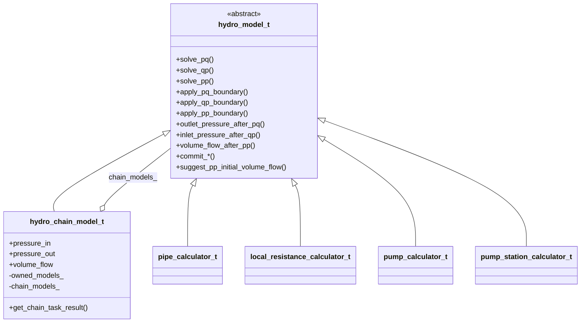

# План: PP-цепочка и рефакторинг `hydro_model_t` (задача 4)

ТЗ: [4_pp_chain_tz.md](4_pp_chain_tz.md).

**Уточнение архитектуры (от пользователя):** `hydro_model_t` — **класс** (не `struct`), единый полиморфный тип по образцу [logger_base.h](../../src/logger_base.h). Класс **`chain_task_calculator_t` удаляется** — его роль выполняет **наследник** `hydro_model_t`, собирающий цепочку из звеньев.

---

## Целевая иерархия



**Точка входа для расчёта цепочки:** `hydro_chain_model_t` (или `std::unique_ptr<hydro_model_t>`, указывающий на него), **не** `chain_task_calculator_t`.

**Листья** (`pipe_calculator_t`, …) — по-прежнему `public hydro_model_t`; их `solve_pp()` (задача 2) остаётся для unit-тестов одиночного элемента.

**Композит** (`hydro_chain_model_t`) — весь бывший код `chain_task_calculator_t`: фабрика звеньев, циклы PQ/QP, PP через Ньютон.

---

## Текущее состояние

| Компонент | Статус |
|-----------|--------|
| `struct hydro_model_t` + листья | Есть, нужно `class` |
| `chain_task_calculator_t` | Дублирует роль композита; **удалить** |
| `solve_pp` цепочки | Неверно: `elem->solve_pp()` по звеньям |
| `get_chain_task_result()` | Баг: проверяет все 4 типа результатов |
| Тесты цепочки | Только валидация; используют `chain_task_calculator_t` |

---

## 1. Рефакторинг [hydraulic_chain.h](../../src/hydraulic_chain.h)

### `class hydro_model_t`

- Заменить `struct` → **`class`** (как `logger_base`).
- Добавить виртуальный хук (дефолт `quiet_NaN()`):

  ```cpp
  virtual double suggest_pp_initial_volume_flow() const;
  ```

- Интерфейс `solve_pq` / `solve_qp` / `solve_pp`, `apply_*`, `outlet_*` / `commit_*` — без изменения контракта для листьев.

### `class hydro_chain_model_t : public hydro_model_t`

Перенести из `chain_task_calculator_t`:

| Было у `chain_task_calculator_t` | Станет у `hydro_chain_model_t` |
|----------------------------------|--------------------------------|
| `pressure_in`, `pressure_out`, `volume_flow` | публичные поля |
| `solve_pq` / `solve_qp` / `solve_pp` | `override` |
| `get_chain_task_result()` | метод композита (не в базе) |
| `owned_models_`, `chain_models_`, `chain_task_properties`, `chain_task_result` | `private` |
| `build_chain_models`, `ensure_not_null`, фабрики | `private` / анонимный namespace в `.cpp` |

Конструктор: `explicit hydro_chain_model_t(const chain_task_properties_t& props);`

`apply_*` / `outlet_*` / `commit_*` / `volume_flow_after_pp` у композита — реализации-обёртки над циклом (как сейчас в калькуляторе).

### Удалить

- Класс **`chain_task_calculator_t`** целиком.

`chain_task_properties_t`, `chain_task_result_t`, `type_of_obj_t` — **оставить** (входные/выходные DTO).

---

## 2. [hydraulic_chain.cpp](../../src/hydraulic_chain.cpp)

- Переименовать все `chain_task_calculator_t::` → `hydro_chain_model_t::`.
- Логику PQ/QP — без изменений (полиморфный цикл по `chain_models_`).
- При сборке — `std::array<bool, 4> chain_has_type_` для валидации результата.

### `hydro_chain_model_t::solve_pp()` (по ТЗ)

Внешний **`fixed_newton_raphson<1>`** по `Q_in`; на каждом пробном `Q` — **внутренний PQ-проход** (не `elem->solve_pp()`):

```cpp
double p = pressure_in;
for (hydro_model_t* elem : chain_models_) {
    elem->apply_pq_boundary(p, q_trial);
    elem->solve_pq();
    p = elem->outlet_pressure_after_pq();
}
// r(Q) = pressure_out - p
```

- Пробные итерации — **без** `commit_*`.
- После сходимости: `volume_flow = Q*`; `solve_pq()` с `commit_*`.
- Нуль расхода: если `|r(0)|` < tol → `Q = 0`, финальный `solve_pq()`.
- `Q₀`: обход `chain_models_`, первый `suggest_pp_initial_volume_flow()`; иначе `0.01`.
- `#include <fixed/fixed.h>` только в этом `.cpp`.

### `pipe_calculator_t`

- `override double suggest_pp_initial_volume_flow() const` → `get_pp_initial_volume_flow()`.

---

## 3. `get_chain_task_result()`

Проверять готовность **только** типов, присутствующих в `chain` (`chain_has_type_`), плюс агрегатные `pressure_in` / `pressure_out` / `volume_flow`.

---

## 4. Потребители кода

| Файл | Изменение |
|------|-----------|
| [test_hydraulic_chain.cpp](../../test/test_hydraulic_chain.cpp) | `hydro_chain_model_t` вместо `chain_task_calculator_t`; новые PP-тесты |
| Остальные `test_*.cpp` | Без изменений (листья) |
| [pipe_oil.h](../../src/pipe_oil.h) и др. | `struct hydro_model_t` → `class` в комментариях не нужно; наследование то же |

---

## 5. Тесты PP цепочки — [test_hydraulic_chain.cpp](../../test/test_hydraulic_chain.cpp)

### `SolvePpSinglePipeRoundTrip`

- `hydro_chain_model_t` с `{pipe}`; PQ → сброс `volume_flow` → PP → `EXPECT_NEAR` Q; повторный PQ → `pressure_out`.

### `SolvePpMixedChainRoundTrip`

- `{pipe, pump, local_resistance}`; тот же round-trip.

Допуски: `1e-4` (Q), `1.0` Па (давление) — как в [test_pipe_oil.cpp](../../test/test_pipe_oil.cpp).

---

## 6. Что не менять

- Математику листьев (`pipe_oil.cpp` `solve_pp` с Ньютоном и т.д.).
- CMake / `fixed_solvers`.
- Отдельные модули `pp_solver.h` — не создавать.
- Фабрику без `switch` (таблица `k_hydro_factories`).

---

## Порядок работ

1. `class hydro_model_t` + `suggest_pp_initial_volume_flow`; `class hydro_chain_model_t`; удалить `chain_task_calculator_t` в заголовке.
2. Перенос реализации в [hydraulic_chain.cpp](../../src/hydraulic_chain.cpp); PP через Ньютон + PQ.
3. `override suggest_pp_initial_volume_flow` у `pipe_calculator_t`.
4. `chain_has_type_` + исправление `get_chain_task_result()`.
5. Обновить [test_hydraulic_chain.cpp](../../test/test_hydraulic_chain.cpp).
6. Сборка и прогон тестов.

---

## Критерии приёмки

- `hydro_model_t` — **`class`**, абстрактный базовый интерфейс.
- **`chain_task_calculator_t` отсутствует**; цепочка — `hydro_chain_model_t : public hydro_model_t`.
- PQ/QP/PP цепочки — полиморфные вызовы по `hydro_model_t*` без `switch` по конкретным классам в расчётных циклах.
- PP цепочки: `fixed_newton_raphson<1>` + внутренний PQ, без `elem->solve_pp()`.
- Новый тип элемента = новый наследник `hydro_model_t` + строка в фабрике; алгоритм PP цепочки не меняется.
- Тесты PP цепочки с численной проверкой.
- `get_chain_task_result()` корректен для произвольного состава цепочки.
